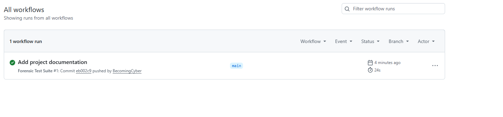

# 🔬 AI-Assisted Synthetic Media Forensics

An evidence-first digital media forensics application for analyzing image files using file validation, SHA-256 hashing, EXIF metadata review, image-structure analysis, heuristic forensic signals, AI-assisted explanation, and professional PDF reporting.

> **Important:** This project does not claim to definitively determine whether an image is AI-generated. It identifies measurable forensic signals that may warrant additional investigation and human review.

---

## 📸 Application Preview

The application provides a browser-based forensic workflow for uploading and analyzing authorized image evidence.

The dashboard presents:

- Evidence information
- SHA-256 file hash
- EXIF metadata findings
- Image structure measurements
- Forensic review signals
- Heuristic review score
- AI-assisted explanation
- Human-review guidance

---

## 🎯 Project Purpose

Synthetic media investigations require more than asking an AI model whether an image is "real or fake."

This project demonstrates an evidence-first workflow where measurable properties of the file are examined before AI is used to explain the findings.

The application is designed for:

- Digital forensics education
- Synthetic media research
- Evidence triage
- Fraud investigation support
- Security research
- Authorized forensic analysis
- Cybersecurity portfolio demonstration

The goal is to help an investigator answer:

**What does the file actually tell us, what signals deserve additional review, and what conclusions are not supported by the available evidence?**

---

## 🔎 Forensic Workflow

```text
Upload Evidence
      ↓
File Validation
      ↓
SHA-256 Hashing
      ↓
EXIF Metadata Analysis
      ↓
Image Signal Analysis
      ↓
Forensic Signal Detection
      ↓
Heuristic Review Scoring
      ↓
AI-Assisted Explanation
      ↓
Human Review
      ↓
PDF Forensic Report
```

The workflow intentionally separates **evidence collection**, **signal detection**, and **interpretation**.

---

## 🧪 Core Capabilities

### File Validation

Uploaded evidence is validated before analysis.

The application currently supports:

- JPG
- JPEG
- PNG

Validation helps prevent unsupported or malformed files from entering the analysis workflow.

---

### 🔐 SHA-256 Evidence Hashing

Each analyzed file receives a SHA-256 cryptographic hash.

The hash provides a digital fingerprint that can be used to:

- Identify the analyzed file
- Detect file changes
- Support evidence documentation
- Demonstrate basic evidence-integrity practices

Changing the contents of a file produces a different hash.

---

### 🏷️ EXIF Metadata Analysis

The application examines available EXIF metadata and extracts focused forensic fields when present.

Metadata can provide useful investigative context such as:

- Camera information
- Software information
- Capture information
- Image properties
- Timestamps

Metadata absence is **not automatically treated as evidence of manipulation** because legitimate applications, screenshots, exports, social platforms, and editing workflows may remove metadata.

---

### 🖼️ Image Signal Analysis

The application performs measurable image analysis using OpenCV and NumPy.

Current measurements include:

| Signal             | Purpose                                   |
| ------------------ | ----------------------------------------- |
| Dimensions         | Records image width and height            |
| Aspect Ratio       | Describes image proportions               |
| Mean Brightness    | Measures average image intensity          |
| Edge Density       | Measures the proportion of detected edges |
| Laplacian Variance | Provides a sharpness/detail measurement   |

These measurements provide structured forensic observations for downstream analysis.

---

## 🚨 Forensic Signal Detection

The detector evaluates configured conditions and identifies observations that may deserve investigator review.

Examples include:

- Missing EXIF metadata
- Image structure characteristics
- Other configured forensic indicators

Each detected signal contains:

- Signal name
- Description
- Category
- Weight

Signals are combined into a **heuristic review score**.

---

## 📊 Review Score

The dashboard displays a review score based on configured forensic signals.

For example:

```text
Review Score: 20 / 100
Assessment: Review Recommended
Signals Detected: 1
```

The score is a **triage indicator**, not a probability.

A score of `20` does **not** mean there is a 20% probability that an image is AI-generated.

The application explicitly warns:

> The review score is a heuristic indicator based on configured forensic signals. It is not a probability of AI generation and does not establish authenticity.

---

## 🤖 AI-Assisted Explanation

After measurable evidence has been collected and evaluated, the application can generate an investigator-friendly explanation of the findings.

The explanation is designed to discuss:

- Assessment summary
- Observed signals
- Possible explanations
- Limitations
- Recommended next steps

The project supports a deterministic fallback mode so the forensic workflow can operate without requiring an external AI service.

AI is used as an **explanation layer**, not as the source of forensic evidence.

---

## 🧠 Evidence-First Design

A central design principle of this project is:

```text
Evidence → Signals → Analysis → Explanation → Human Judgment
```

Not:

```text
Image → Ask AI → Declare Real or Fake
```

The application separates measurable observations from interpretation so investigators can review the underlying evidence.

---

## ⚠️ False Positives and False Negatives

Synthetic media detection is not definitive.

### False Positive

A legitimate image may exhibit characteristics that resemble manipulation or synthetic-media signals.

Possible causes include:

- Image compression
- Editing
- Metadata removal
- Resizing
- Screenshot capture
- Social-media processing
- Camera or software differences

### False Negative

A manipulated or AI-generated image may contain few or none of the configured signals.

Therefore:

> No individual metadata field, image statistic, heuristic score, or AI explanation should be treated as conclusive proof of authenticity or synthetic generation.

Multiple techniques and human review should be used together.

---

## 📄 PDF Forensic Reporting

The application can generate a professional PDF forensic report from completed analysis results.

Reports document information such as:

- Evidence filename
- File type
- File size
- SHA-256 hash
- Image dimensions
- Metadata findings
- Image-analysis measurements
- Forensic signals
- Review score
- Assessment
- AI-assisted explanation
- Methodology limitations
- Investigator guidance

Generated reports are excluded from source control.

---

## 🛡️ Evidence Handling

Uploaded evidence is processed using a randomized temporary filename.

After analysis, the temporary uploaded file is removed.

This reduces unnecessary retention of user-provided evidence.

The `uploads/` and `reports/` directories remain in the repository through `.gitkeep` files while generated evidence and reports are excluded from Git.

---

## 🧪 Automated Testing

The project includes automated pytest coverage for the major analysis components.

Current test areas include:

- File hashing
- File validation
- Evidence information extraction
- EXIF metadata extraction
- Metadata summarization
- Image loading
- Dimension analysis
- Brightness analysis
- Edge-density analysis
- Sharpness analysis
- Forensic signal detection
- Review scoring
- AI explanation behavior
- PDF report generation

Current test suite:

```text
47 passed
```

Run the complete test suite with:

```powershell
python -m pytest -v
```

---

## ⚙️ Continuous Integration

GitHub Actions is configured to automatically execute the forensic test suite on:

- Pushes to `main`
- Pull requests targeting `main`

The CI workflow runs the application in mock AI mode so automated testing does not require an API key or make external AI requests.

Workflow:

```text
Code Change
     ↓
Push / Pull Request
     ↓
GitHub Actions
     ↓
Install Dependencies
     ↓
Run Pytest
     ↓
Validate Forensic Components
```

---

## 🏗️ Project Structure

```text
AI-MEDIA-FORENSICS/
│
├── .github/
│   └── workflows/
│       └── tests.yml
│
├── app/
│   ├── analyzer/
│   │   ├── ai_explainer.py
│   │   ├── file_analyzer.py
│   │   └── image_analyzer.py
│   │
│   ├── detector/
│   │   └── detector.py
│   │
│   ├── metadata/
│   │   └── metadata_analyzer.py
│   │
│   ├── reporting/
│   │   └── pdf_report.py
│   │
│   ├── static/
│   │   └── style.css
│   │
│   └── templates/
│       └── dashboard.html
│
├── reports/
│   └── .gitkeep
│
├── tests/
│   ├── test_ai_explainer.py
│   ├── test_detector.py
│   ├── test_file_analyzer.py
│   ├── test_image_analyzer.py
│   ├── test_metadata_analyzer.py
│   └── test_pdf_report.py
│
├── uploads/
│   └── .gitkeep
│
├── .env.example
├── .gitignore
├── app.py
├── README.md
└── requirements.txt
```

---

## 🛠️ Technologies

The project uses:

- Python
- Flask
- OpenCV
- Pillow
- NumPy
- ReportLab
- pytest
- Git
- GitHub Actions
- HTML
- CSS

---

## 🚀 Installation

Clone the repository:

```powershell
git clone <repository-url>
cd AI-MEDIA-FORENSICS
```

Create a virtual environment:

```powershell
python -m venv venv
```

Activate it on Windows:

```powershell
.\venv\Scripts\Activate.ps1
```

Install dependencies:

```powershell
python -m pip install -r requirements.txt
```

---

## 🔧 Environment Configuration

Copy:

```text
.env.example
```

to:

```text
.env
```

Environment variables should be stored in `.env`.

Never commit API keys or other secrets to source control.

The project can operate in mock mode without an external AI API.

---

## ▶️ Running the Application

Start the Flask application:

```powershell
python app.py
```

Then open:

```text
http://127.0.0.1:5000
```

Upload an authorized JPG, JPEG, or PNG image and select:

**Run Forensic Analysis**

---

## 🔒 Security and Forensic Design Decisions

Several decisions were intentionally incorporated into the project:

**Evidence validation**  
Unsupported file types are rejected before analysis.

**Evidence hashing**  
SHA-256 identifies the exact file examined.

**Temporary evidence handling**  
Uploaded evidence is removed after processing.

**Secret protection**  
Environment files and credentials are excluded from Git.

**Evidence-first analysis**  
AI explanation occurs after measurable forensic analysis.

**Conservative conclusions**  
The application avoids declaring an image authentic, manipulated, or AI-generated based solely on heuristic signals.

**Human verification**  
Final interpretation remains an investigator responsibility.

---

## 🚧 Limitations

This project is an educational and portfolio forensic-analysis platform, not a validated commercial synthetic-media detector.

Current limitations include:

- Heuristic signals cannot prove AI generation.
- EXIF metadata can be modified or removed.
- Metadata absence is not proof of manipulation.
- Image statistics may have many legitimate explanations.
- AI-generated images may not trigger configured signals.
- Traditional images may trigger review signals.
- AI explanations may contain errors.
- Current analysis focuses on still images.
- Human verification remains necessary.

---

## 🔮 Future Enhancements

Potential future improvements include:

- Error Level Analysis (ELA)
- Perceptual hashing
- Duplicate-image comparison
- Manipulation heatmaps
- Additional metadata consistency checks
- Configurable detection rules
- Case management
- Evidence history
- Persistent assessment storage
- Additional image formats
- Audio forensic analysis
- Video forensic analysis
- Specialized synthetic-media detection models

---

## 🎓 Skills Demonstrated

This project demonstrates practical experience with:

- Digital forensics
- Evidence handling
- File integrity verification
- SHA-256 hashing
- EXIF metadata analysis
- Image analysis
- OpenCV
- NumPy
- Synthetic media investigation
- Python development
- Flask application development
- Secure file uploads
- AI-assisted analysis
- Heuristic detection logic
- PDF report generation
- Automated testing
- GitHub Actions CI
- Security documentation
- Human-centered forensic interpretation

---

## ⚖️ Responsible Use

This application is intended for:

- Authorized forensic analysis
- Cybersecurity education
- Digital-forensics research
- Defensive security testing
- Portfolio demonstration

Users are responsible for ensuring they have authorization to analyze submitted media and for independently validating findings before making investigative, legal, security, or authenticity conclusions.

---

## 👤 Author

**BecomingCyber**

Cybersecurity • Digital Forensics • DFIR • AI Security

---

## 📌 Portfolio Context

This project is part of a hands-on cybersecurity portfolio focused on building practical systems that demonstrate the complete investigative workflow:

```text
Collect → Validate → Analyze → Interpret → Document → Verify
```

**Build the skills. Prove the work.**

---

## ✅ Continuous Integration

Every push and pull request to `main` runs the automated forensic test suite through GitHub Actions.

The CI workflow:

- Uses Python 3.12
- Installs the project dependencies
- Runs the application in mock AI mode
- Executes the complete pytest suite
- Requires no API key or external AI request
- Verifies the forensic analysis, detection, metadata, AI-explanation, and PDF-reporting components

**Current automated test suite: 47 tests passing.**



This provides reproducible evidence that the project's core forensic workflow is automatically validated whenever the code changes.
